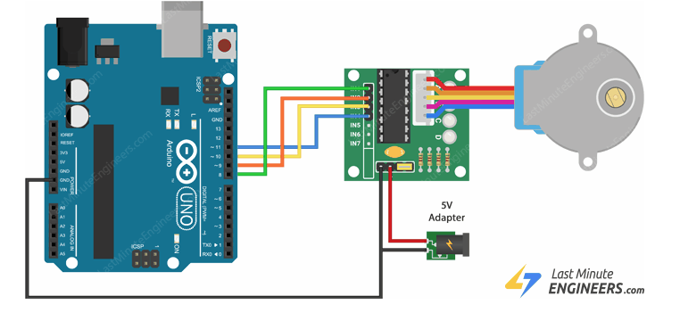
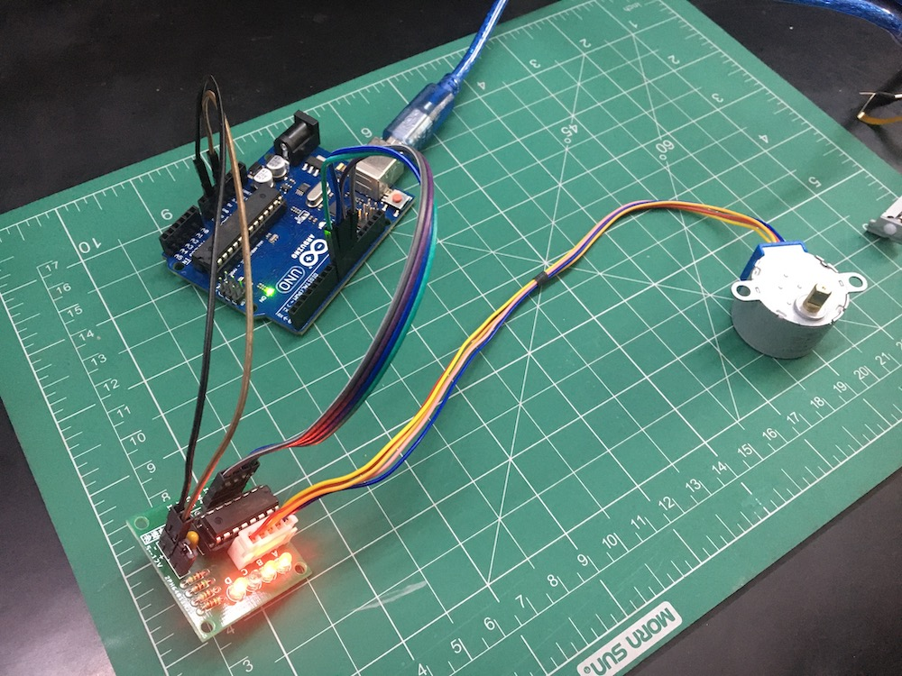
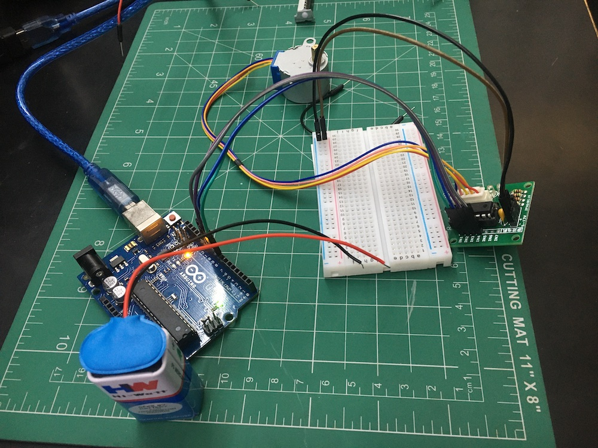

I was trying to get the stepper code work but nothing was happening. Turns out one of the wire was defective. Lesson learned. Always check wire before using.

## 

The next thing is to learn how to make a circuit using battery and breadboard.

This setup worked without conecting the ground to the arduino board. Do not know if this is safe.

## Bipolar stepper

## References

- https://docs.arduino.cc/learn/electronics/stepper-motors#unipolar-stepper-circuit-and-schematic
- https://forum.arduino.cc/t/stepper-motor-example-does-not-work/632763/5
- https://lastminuteengineers.com/28byj48-stepper-motor-arduino-tutorial/
- [Bipolar Circuit](https://circuitmagic.com/arduino/how-to-run-a-stepper-motor-with-an-arduino-l293d-ic/)